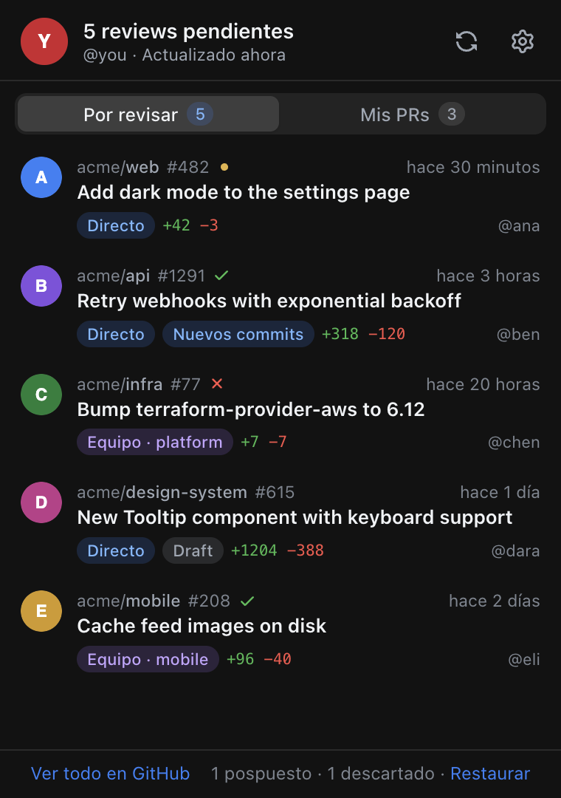
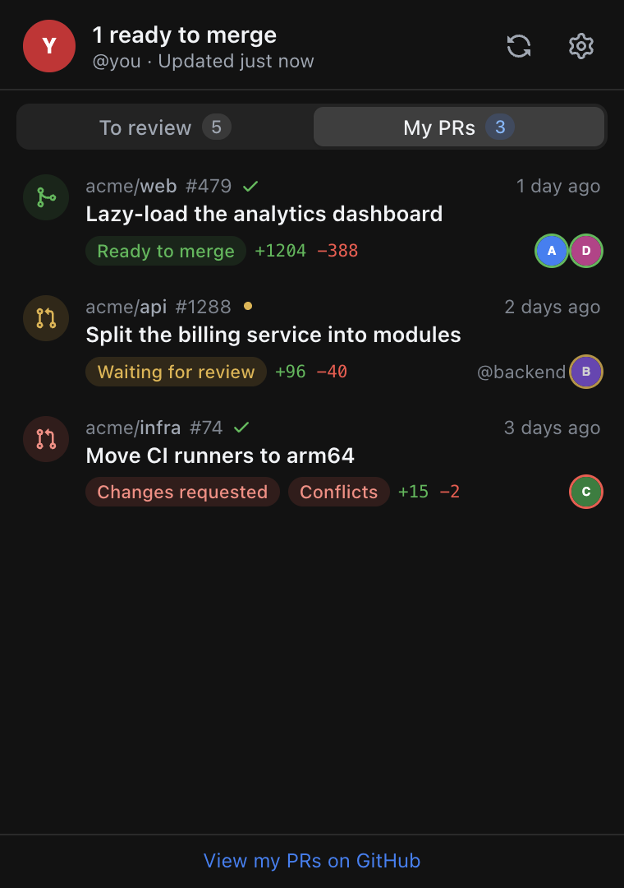

# PR Radar

[](https://github.com/gmunozc/pr-radar/actions/workflows/ci.yml)

PR Radar es una app de barra de menú para macOS que te avisa cuando alguien te pide revisar un pull request y sigue el estado de tus propios PRs. También se compila para Windows y Linux, pero esas versiones no están probadas.

[Read in English](README.md)

<p>
  
  
</p>

## Funciones

- **Contador en la barra de menú** con los pull requests que esperan tu review. El icono se atenúa si no hay conexión con GitHub y muestra un punto cuando tienes que volver a conectar.
- **Notificaciones nativas:**
  - cuando te piden una review nueva, o te la vuelven a pedir después de que el autor subiera commits nuevos, con botones para posponerla o descartarla;
  - cuando aprueban un PR tuyo, te piden cambios, queda listo para merge, fallan sus checks o tiene conflictos.
- **Pestaña Por revisar:**
  - el estado de los checks de cada PR;
  - si la petición es para ti o para uno de tus equipos;
  - un aviso de **Nuevos commits** cuando el autor subió cambios después de tu última review.
- **Pestaña Mis PRs:**
  - en qué punto está cada PR (esperando, aprobado, cambios solicitados, sin reviewers);
  - quién aprobó, quién pidió cambios y quién falta por revisar;
  - **Listo para merge**, o qué lo bloquea (conflictos, desactualizado, bloqueado);
  - una etiqueta **Auto-merge** cuando GitHub lo va a mergear solo.
- **Actúa sobre tus PRs** desde el panel (sesiones con la OAuth App): mergear ahora con el método del repositorio, actualizar la rama cuando está desactualizada, activar o desactivar el auto-merge de GitHub, volver a pedir revisión a quien pidió cambios, copiar el nombre de la rama o el enlace.
- **Aprobar** una review desde el panel (sesiones con la OAuth App, nunca un PR tuyo), con un comentario opcional.
- **Descartar o posponer** una review ("en 1 hora", "mañana 9:00", "hasta nuevos commits"). Un PR pospuesto vuelve con un recordatorio, y uno descartado vuelve si te piden review de nuevo.
- **Filtros y orden** en la lista de reviews (directas o de equipo, organización; más nuevas, más antiguas o actualizadas hace poco), **etiquetas** con sus colores, y las reviews que llevan más días de los que quieres, resaltadas.
- **Menos ruido:** oculta los PRs de Dependabot, Renovate y GitHub Actions, o de los repositorios y autores que elijas.
- **Mergear cuando esté listo:** donde el auto-merge de GitHub no está disponible, PR Radar puede mergear un PR tuyo por su cuenta cuando GitHub lo da por mergeable (dos consultas seguidas, checks en verde, con el último commit que vio). Sigue armado si vuelves a subir cambios; cualquier fallo lo desarma y te avisa.
- **Qué bloquea un PR:** pulsa el icono de los checks para ver cada uno y abrir su página; tus PRs muestran los hilos sin resolver y las aprobaciones requeridas ("1/2").
- **Pestaña Participo:** PRs donde te mencionaron, te asignaron o comentaste sin que te pidieran review (se puede desactivar en Ajustes).
- **Teclado:** las flechas recorren los PRs, Enter abre, clic derecho o Shift+F10 muestra el menú, Escape cierra el panel, ⌘R actualiza, ⌘1/⌘2/⌘3 cambian de pestaña y ⌘, abre Ajustes. Un atajo global (Ajustes → General) abre el panel desde cualquier app.
- **Horario laboral (opcional):** fuera de él, los avisos esperan y llegan juntos en un solo resumen "Mientras no estabas".
- **Resumen diario** con lo pendiente, en días laborables y a la hora que elijas.
- **En inglés y en español**, según el idioma del sistema o lo que elijas en Ajustes.
- **Aviso de versión nueva.** En macOS, **Instalar** descarga el dmg, lo comprueba contra el `SHA256SUMS.txt` de la Release y lo abre; en otros sistemas enlaza a la Release.
- **Tamaño del panel** (compacto, normal, grande) en Ajustes → General.
- **Detalle del PR** dentro del panel: pulsa un título para ver los checks, quién revisó, archivos, commits, comentarios y la descripción.
- **Copiar diagnóstico:** un informe para adjuntar a un issue, sin tokens.

## Instalación

1. Descarga de la [última Release](https://github.com/gmunozc/pr-radar/releases/latest) el dmg para tu Mac: `PR-Radar-<versión>-arm64.dmg` si es Apple Silicon (M1 o posterior), o `PR-Radar-<versión>-x64.dmg` si es Intel. ¿No sabes cuál tienes? Menú Apple → Acerca de este Mac: si pone "Chip", es Apple Silicon; si pone "Procesador", es Intel.
2. Ábrelo y arrastra **PR Radar** a Aplicaciones.
3. **La primera vez:** la app no está firmada con un Developer ID de Apple, así que macOS la bloquea. Haz clic derecho → **Abrir**, o ve a Ajustes del Sistema → Privacidad y seguridad → **Abrir igualmente**.
4. macOS pedirá permiso para que PR Radar use **"PR Radar Safe Storage"** en el Llavero: elige **Permitir siempre**. Como la app no está firmada, el aviso vuelve a salir con cada actualización.

Para verificar la descarga, deja el `SHA256SUMS.txt` de la Release en la misma carpeta y ejecuta:

```sh
shasum -a 256 -c SHA256SUMS.txt --ignore-missing
# o comprueba que lo generó el workflow de Release de este repositorio:
gh attestation verify PR-Radar-<versión>-arm64.dmg --repo gmunozc/pr-radar
```

## Conectar tu cuenta

Pulsa **Conectar con GitHub**, introduce en github.com el código que aparece y listo. Hay dos formas de conectar:

| | GitHub App (recomendada) | OAuth App |
|---|---|---|
| Acceso | Solo lectura: pull requests, checks, estados de commits y miembros de la organización | Permiso `repo` completo (lectura y escritura en todos tus repos) |
| Qué PRs ve | Solo en los repos donde la app está instalada | En todos los repos a los que tienes acceso |
| Organizaciones | Un owner instala la app en la organización | Un owner aprueba la app si la organización restringe las OAuth Apps |
| Acciones sobre tus PRs | No (solo lectura) | Merge, actualizar rama, auto-merge |

Con la GitHub App, instálala en tu cuenta y en cada organización donde revisas. Si la lista sale vacía, el panel muestra un botón para instalarla.

Bajo el botón de conectar está **Usar la OAuth App**. La sesión se renueva sola; solo hay que volver a conectar si revocas el acceso.

Si una organización usa **SAML SSO**, autoriza la app para ella; el panel avisa cuando hay resultados ocultos por ese motivo.

## Cómo funcionan los avisos

- **La primera vez:** un solo resumen en lugar de un aviso por PR.
- **Reviews nuevas:** hasta tres avisos individuales; si son más, se agrupan en uno.
- **Botones:** las reviews y los recordatorios llevan **Posponer 1 h**, **Hasta mañana** y **Descartar**. En macOS, pasa el ratón por encima del aviso y abre **Opciones**.
- **Tus PRs:** "aprobado", "cambios solicitados", "listo para merge" y "fallan los checks" (estos dos una vez por cada push), y "conflictos". Se desactivan en Ajustes → **Novedades en mis PRs**.
- **PRs pospuestos:** vuelven con un recordatorio.
- **Centro de notificaciones:** los avisos se apilan por repositorio y muestran el avatar de quien actuó. Desaparecen solos cuando el PR se revisa, se mergea, se descarta o se pospone, cuando sus checks vuelven a estar en verde o se resuelven sus conflictos, y al cerrar sesión.
- **Horario laboral:** fuera de él, los avisos esperan, y al empezar la jornada llega uno solo, "Mientras no estabas". Si el resumen diario toca dentro de la hora siguiente, se fusionan.
- **Resumen diario:** como mucho uno al día, y no se envía si no hay nada pendiente.

PR Radar consulta GitHub cada 30 segundos por defecto (mínimo 15). Cada consulta es una query de GraphQL que gasta unos 6 de los 5000 puntos por hora que permite GitHub.

## Privacidad y seguridad

- **Sin telemetría.** La app solo se comunica con GitHub:
  - `api.github.com`, para tus datos;
  - `github.com`, para conectar y buscar versiones nuevas;
  - `avatars.githubusercontent.com`, para las fotos de perfil.
- **Lo que guarda en tu Mac**, en `~/Library/Application Support/PR Radar/`:
  - `auth.bin`: tu sesión de GitHub, cifrada con una clave que guarda el Llavero de macOS.
  - `settings.json`: tus ajustes.
  - `state.json`: qué PRs has visto, descartado o pospuesto, y los avisos que esperan al horario laboral.
  - `app.json`: lo que encontró la comprobación de versiones.
  - `logs/`: el registro de actividad, sin tokens.
- **Puedes revocar el acceso cuando quieras:**
  - la OAuth App, en [Authorized OAuth Apps](https://github.com/settings/applications);
  - la GitHub App, en [Applications → Installed GitHub Apps](https://github.com/settings/installations).
- **Electron endurecido:**
  - el panel corre aislado (sandbox y context isolation) con una Content Security Policy estricta;
  - los enlaces externos solo se abren si son de `https://github.com`.

Para reportar una vulnerabilidad, mira [SECURITY.md](SECURITY.md).

## Problemas frecuentes

- **No aparecen las notificaciones.** Comprueba que no haya ningún modo Concentración activo y que PR Radar tenga permiso en Ajustes del Sistema → Notificaciones. **Ajustes → Probar** envía una; llega al Centro de notificaciones aunque los avisos estén ocultos.
- **Faltan PRs de una organización:**
  - GitHub App: instálala en esa organización.
  - OAuth App: puede que un owner tenga que aprobarla. El enlace **Dar acceso a la org** abre la página adecuada de GitHub.
  - SAML SSO: autoriza la app para esa organización.
- **"Tu sesión de GitHub caducó".** Vuelve a conectar; tus PRs descartados y pospuestos se conservan.
- **Cualquier otro problema:** Ajustes → Ayuda → **Copiar diagnóstico** y pégalo en un [reporte de error](https://github.com/gmunozc/pr-radar/issues/new/choose).

## Compilar desde el código

Necesitas Node.js 24 o superior y npm.

```sh
git clone https://github.com/gmunozc/pr-radar.git
cd pr-radar
npm ci
cp .env.example .env   # pon tus propios Client ID (ver abajo)
npm run dev            # con recarga en caliente (usa una carpeta aparte, "PR Radar Dev")
npm test               # tests unitarios
npm run typecheck
npm run dist:mac       # dist/PR-Radar-<versión>-arm64.dmg y -x64.dmg
```

Necesitas tu propia GitHub App, tu propia OAuth App o ambas:

- **GitHub App** (Settings → Developer settings → GitHub Apps):
  - Activa Device Flow, deja marcado "Expire user authorization tokens" y desactiva el webhook.
  - Permisos, todos de solo lectura: Pull requests, Checks, Commit statuses y Members (de la organización).
  - Pon su Client ID y su slug en `MAIN_VITE_GITHUB_APP_CLIENT_ID` y `MAIN_VITE_GITHUB_APP_SLUG`.
- **OAuth App** (Settings → Developer settings → OAuth Apps):
  - Activa Device Flow. Sirve cualquier homepage y callback.
  - Pon su Client ID en `MAIN_VITE_GITHUB_CLIENT_ID`.

Si haces un fork, pon tu propio `owner/repo` en `MAIN_VITE_UPDATE_REPO`, o déjalo vacío para desactivar el aviso de versión nueva. La estructura del proyecto y el proceso de publicación están en [CONTRIBUTING.md](CONTRIBUTING.md).

## Licencia

[MIT](LICENSE). Los iconos son de [GitHub Octicons](https://github.com/primer/octicons) (MIT); ver [THIRD_PARTY_NOTICES.md](THIRD_PARTY_NOTICES.md).

PR Radar es un proyecto independiente, sin relación con GitHub ni respaldo de GitHub.
