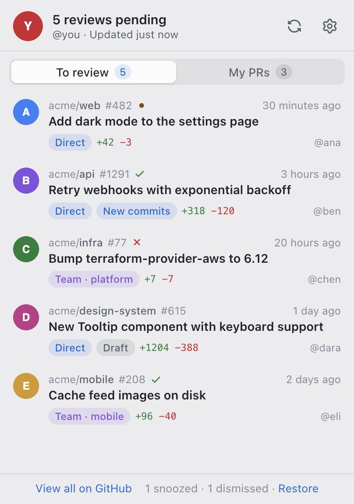
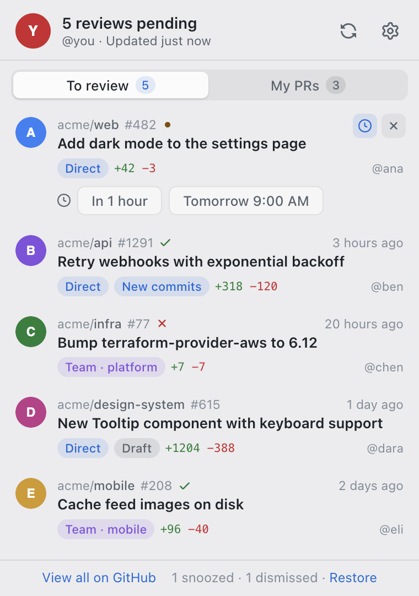
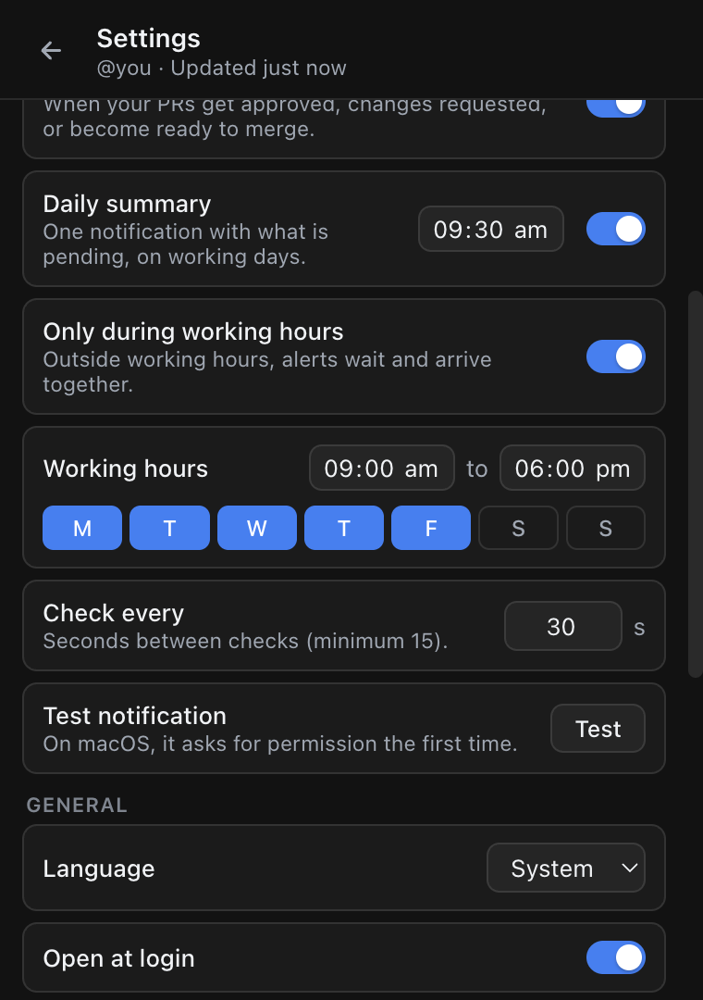

# PR Radar

[](https://github.com/gmunozc/pr-radar/actions/workflows/ci.yml)

A macOS menu bar app that tells you when someone asks you to review a pull request, and keeps an eye on your own PRs. It also builds for Windows and Linux, but those builds are untested.

[Leer en español](README.es.md)

<p>
  
  
</p>

## Features

- **Menu bar count** of the pull requests waiting for your review. The icon dims when GitHub can't be reached and shows a badge when you need to sign in again.
- **Native notifications:**
  - a new review request, or a review requested again after the author pushed new commits;
  - one of your PRs is approved, gets changes requested, or becomes ready to merge.
- **To review** tab:
  - the status of each PR's checks;
  - whether the request was sent to you or to one of your teams;
  - a **New commits** flag when the author pushed after your last review.
- **My PRs** tab:
  - where each PR stands (waiting, approved, changes requested, no reviewers);
  - who approved, who asked for changes and who is still pending;
  - **Ready to merge**, or what's blocking it (conflicts, out of date, blocked).
- **Dismiss or snooze** a review request ("in 1 hour", "tomorrow 9:00"). A snoozed PR comes back with a reminder, and a dismissed one comes back if your review is requested again.
- **Working hours (optional):** outside them, notifications wait and arrive together as one "While you were away" summary.
- **Daily summary** of what's pending, on working days at the time you choose.
- **English and Spanish**, following the system language or your choice in Settings.
- **New version notice** with a link to the release.
- **Copy diagnostics:** a report you can attach to an issue, with tokens removed.

<p>
  
  
</p>

## Install

1. Download the dmg for your Mac from the [latest release](https://github.com/gmunozc/pr-radar/releases/latest): `PR-Radar-<version>-arm64.dmg` for Apple Silicon (M1 or later) or `PR-Radar-<version>-x64.dmg` for Intel. Not sure which one you have? Apple menu → About This Mac: "Chip" means Apple Silicon, "Processor" means Intel.
2. Open it and drag **PR Radar** to Applications.
3. **First launch:** the app is not signed with an Apple Developer ID, so macOS blocks it. Right-click it → **Open**, or go to System Settings → Privacy & Security → **Open Anyway**.
4. macOS asks to let PR Radar use **"PR Radar Safe Storage"** in your Keychain: choose **Always Allow**. Because the app is unsigned, this prompt comes back after every update.

To check the download, put `SHA256SUMS.txt` from the release in the same folder and run:

```sh
shasum -a 256 -c SHA256SUMS.txt --ignore-missing
# or check that it was built by this repository's release workflow:
gh attestation verify PR-Radar-<version>-arm64.dmg --repo gmunozc/pr-radar
```

## Signing in

Click **Connect with GitHub**, enter the code shown on github.com, and you're done. There are two ways to sign in:

| | GitHub App (recommended) | OAuth App |
|---|---|---|
| Access | Read-only: pull requests, checks, commit statuses, organization members | Full `repo` scope (read and write, all your repositories) |
| Which PRs it sees | Only in repositories where the app is installed | Every repository you can access |
| Organizations | An owner installs the app on the organization | An owner approves the app if the organization restricts OAuth Apps |

With the GitHub App, install it on your account and on each organization you review in. If the list is empty, the panel has a button to install it.

Under the login button there's **Use the OAuth App instead**. Sessions renew automatically; you only sign in again if you revoke access.

If an organization uses **SAML SSO**, authorize the app for it; the panel tells you when results are hidden for that reason.

## How notifications work

- **First run:** a single summary instead of one notification per PR.
- **New review requests:** up to three individual notifications; more than that become one grouped notification.
- **Your PRs:** "approved", "changes requested" and "ready to merge", the last one once per push. Turn them off in Settings → **Updates on my PRs**.
- **Snoozed PRs** come back with a reminder.
- **Working hours:** outside them, notifications are held, and one "While you were away" notification arrives when your day starts. If the daily summary is due within the hour, the two are merged.
- **Daily summary:** at most once a day, and skipped when nothing is pending.

PR Radar checks GitHub every 30 seconds by default (minimum 15). Each check is one GraphQL query that costs about 3 points of GitHub's 5,000-points-per-hour limit.

## Privacy and security

- **No telemetry.** The app only talks to GitHub:
  - `api.github.com` for your data;
  - `github.com` to sign in and to check for new releases;
  - `avatars.githubusercontent.com` for profile pictures.
- **Stored on your Mac** in `~/Library/Application Support/PR Radar/`:
  - `auth.bin`: your GitHub session, encrypted with a key kept in the macOS Keychain.
  - `settings.json`: your settings.
  - `state.json`: which PRs you've seen, dismissed or snoozed, and notifications waiting for working hours.
  - `app.json`: what the new-version check found.
  - `logs/`: the activity log, with tokens removed.
- **Revoke access at any time:**
  - the OAuth App, in [Authorized OAuth Apps](https://github.com/settings/applications);
  - the GitHub App, in [Applications → Installed GitHub Apps](https://github.com/settings/installations).
- **Electron hardening:**
  - the panel runs sandboxed with context isolation and a strict Content Security Policy;
  - external links only open for `https://github.com`.

See [SECURITY.md](SECURITY.md) to report a vulnerability.

## Troubleshooting

- **No notifications appear.** Check that no Focus mode is on, and that PR Radar is allowed in System Settings → Notifications. **Settings → Test** sends one; it lands in Notification Center even when banners are hidden.
- **PRs from an organization are missing:**
  - GitHub App: install it on that organization.
  - OAuth App: an owner may need to approve it. The **Grant access to the org** link opens the right GitHub page.
  - SAML SSO: authorize the app for that organization.
- **"Your GitHub session expired."** Reconnect. Your dismissed and snoozed PRs are kept.
- **Anything else:** Settings → Help → **Copy diagnostics**, then paste it in a [bug report](https://github.com/gmunozc/pr-radar/issues/new/choose).

## Build from source

You need Node.js 24+ and npm.

```sh
git clone https://github.com/gmunozc/pr-radar.git
cd pr-radar
npm ci
cp .env.example .env   # add your own client IDs, see below
npm run dev            # run with hot reload (uses a separate "PR Radar Dev" data folder)
npm test               # unit tests
npm run typecheck
npm run dist:mac       # dist/PR-Radar-<version>-arm64.dmg and -x64.dmg
```

You need your own GitHub App and/or OAuth App:

- **GitHub App** (Settings → Developer settings → GitHub Apps):
  - Enable Device Flow, keep "Expire user authorization tokens" on, and turn off the webhook.
  - Permissions, all read-only: Pull requests, Checks, Commit statuses and (organization) Members.
  - Put its client ID and slug in `MAIN_VITE_GITHUB_APP_CLIENT_ID` and `MAIN_VITE_GITHUB_APP_SLUG`.
- **OAuth App** (Settings → Developer settings → OAuth Apps):
  - Enable Device Flow. Any homepage and callback URL works.
  - Put its client ID in `MAIN_VITE_GITHUB_CLIENT_ID`.

Forks should set `MAIN_VITE_UPDATE_REPO` to their own `owner/repo`, or leave it empty to turn off the new-version check. See [CONTRIBUTING.md](CONTRIBUTING.md) for the project layout and the release process.

## License

[MIT](LICENSE). Icons are from [GitHub Octicons](https://github.com/primer/octicons) (MIT); see [THIRD_PARTY_NOTICES.md](THIRD_PARTY_NOTICES.md).

PR Radar is an independent project, not affiliated with or endorsed by GitHub.
